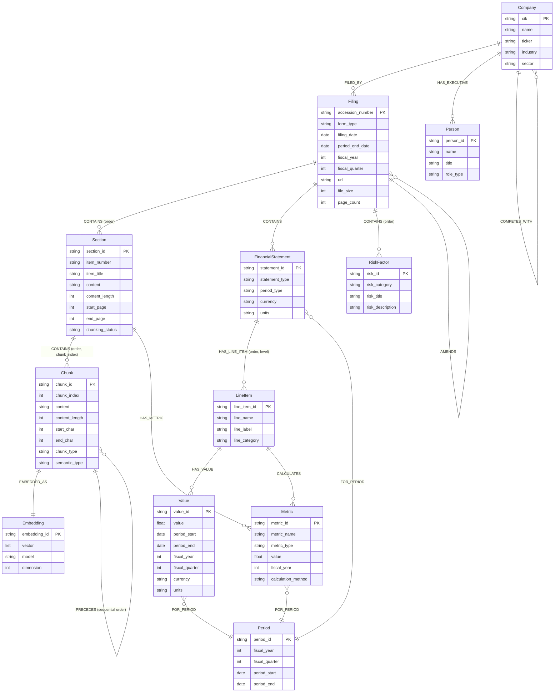

# Neo4j Graph Database Schema Design for EDGAR Financial Data
## Vectorized RAG Datastore for AI Agent Financial Analysis

**Version:** 1.0  
**Date:** 2025-01-15  
**Purpose:** Design a comprehensive Neo4j graph database schema to store EDGAR filing data for use as a vectorized RAG (Retrieval Augmented Generation) datastore, enabling accurate AI agent responses to financial analysis queries.

---

## Table of Contents

1. [Executive Summary](#executive-summary)
2. [Data Source Understanding](#data-source-understanding)
3. [Graph Schema Design](#graph-schema-design)
4. [Node Types and Properties](#node-types-and-properties)
5. [Relationship Types](#relationship-types)
6. [Vector Embeddings Strategy](#vector-embeddings-strategy)
7. [Chunking Strategy](#chunking-strategy)
8. [Indexing Strategy](#indexing-strategy)
9. [Query Patterns](#query-patterns)
10. [Data Ingestion Pipeline](#data-ingestion-pipeline)
11. [RAG Retrieval Patterns](#rag-retrieval-patterns)
12. [Performance Optimization](#performance-optimization)
13. [Implementation Examples](#implementation-examples)

---

## 1. Executive Summary

This document defines a comprehensive Neo4j graph database schema designed to store and retrieve SEC EDGAR filing data for financial analysis. The schema supports:

- **52+ query types** from the EDGAR AI Agent Prompts guide
- **Multi-form analysis** (10-K, 10-Q, 8-K, DEF 14A, etc.)
- **Temporal queries** (trends, historical comparisons)
- **Comparative analysis** (peer comparisons, industry benchmarks)
- **Semantic search** via vector embeddings
- **Structured queries** via graph relationships
- **Hybrid retrieval** combining graph traversal and vector similarity

### Key Design Principles

1. **Hierarchical Structure**: Company → Filing → Section → Content → Metrics
2. **Temporal Tracking**: All time-series data linked with period relationships
3. **Semantic Enrichment**: Vector embeddings for natural language queries
4. **Chunking Strategy**: Large documents split into semantically meaningful chunks
5. **Dual Retrieval**: Graph traversal + vector similarity for comprehensive answers
6. **Source Attribution**: Every data point traceable to specific filing/section

---

## 2. Data Source Understanding

### 2.1 EDGAR Tools & MCP Server Data Structure

Based on SEC EDGAR MCP server patterns, data typically arrives as structured JSON:

```json
{
  "company": {
    "cik": "0000320193",
    "name": "Apple Inc.",
    "ticker": "AAPL",
    "sic": "3571",
    "industry": "Electronic Computers"
  },
  "filing": {
    "accession_number": "0000320193-24-000077",
    "form_type": "10-K",
    "filing_date": "2024-11-01",
    "period_end_date": "2024-09-28",
    "url": "https://www.sec.gov/...",
    "file_size": 5242880
  },
  "sections": [
    {
      "item": "Item 1",
      "title": "Business",
      "content": "...",
      "start_page": 1,
      "end_page": 45
    }
  ],
  "financial_statements": {
    "income_statement": {...},
    "balance_sheet": {...},
    "cash_flow": {...}
  }
}
```

### 2.2 Key Data Characteristics

- **Large Documents**: 10-K filings can be 100-500+ pages
- **Structured + Unstructured**: Financial statements (structured) + MD&A (unstructured)
- **Temporal Nature**: Multiple filings per company over time
- **Cross-References**: Filings reference other filings, companies, events
- **Hierarchical**: Form → Item → Subsection → Paragraph → Sentence

---

## 3. Graph Schema Design

### 3.0 Mermaid Schema Diagram



**Key Hierarchical Relationships:**
- **Company → Filing:** One company files many documents
- **Filing → Section:** One filing contains multiple sections (Item 1, Item 7, Item 8, etc.)
- **Section → Chunk:** One section contains multiple chunks (chunk_0, chunk_1, chunk_2, ...)
- **Chunk → Embedding:** One chunk has exactly one embedding for vector search
- **Chunk → Chunk:** Sequential order via PRECEDES relationship (chunk_0 → chunk_1 → chunk_2)

### 3.0.1 Clarification: Filing → Section → Chunk Hierarchy

**Important:** The relationship is **hierarchical**, not peer-level:

```
Filing (Form 10-K)
  │
  ├─ CONTAINS → Section (Item 1: Business)
  │              │
  │              ├─ CONTAINS → Chunk 0 (chunk_index: 0)
  │              ├─ CONTAINS → Chunk 1 (chunk_index: 1)
  │              ├─ CONTAINS → Chunk 2 (chunk_index: 2)
  │              └─ CONTAINS → Chunk N (chunk_index: N)
  │
  ├─ CONTAINS → Section (Item 7: MD&A)
  │              │
  │              ├─ CONTAINS → Chunk 0 (chunk_index: 0)
  │              ├─ CONTAINS → Chunk 1 (chunk_index: 1)
  │              └─ CONTAINS → Chunk M (chunk_index: M)
  │
  └─ CONTAINS → Section (Item 8: Financial Statements)
                 │
                 └─ CONTAINS → FinancialStatement (not chunked)
```

**Key Points:**
1. **Filing contains Sections:** Each filing (10-K, 10-Q, etc.) has multiple sections (Item 1, Item 7, Item 8, etc.)
2. **Section contains Chunks:** Each section can be split into multiple chunks if the content is large
3. **Chunk Ordering:** Chunks within a section maintain order via:
   - `chunk_index` property (0, 1, 2, ...)
   - `PRECEDES` relationships (chunk_0 → chunk_1 → chunk_2)
4. **Chunk-to-Embedding:** Each chunk has exactly one embedding node for vector search

**Example Query Showing Hierarchy:**
```cypher
// Get all chunks for a filing, showing full hierarchy
MATCH (c:Company {cik: "0000320193"})<-[:FILED_BY]-(f:Filing {accession_number: "0000320193-24-000077"})
MATCH (f)-[:CONTAINS]->(s:Section)
MATCH (s)-[:CONTAINS]->(ch:Chunk)
RETURN 
  f.form_type AS filing_type,
  s.item_number AS section_item,
  s.item_title AS section_title,
  ch.chunk_index AS chunk_order,
  ch.chunk_id AS chunk_id,
  ch.content_length AS chunk_size
ORDER BY s.item_number, ch.chunk_index;
```

**Result:**
```
filing_type | section_item | section_title          | chunk_order | chunk_id                    | chunk_size
------------|--------------|------------------------|-------------|-----------------------------|------------
10-K        | Item 1       | Business               | 0           | ..._Item1_chunk_0          | 1250
10-K        | Item 1       | Business               | 1           | ..._Item1_chunk_1          | 1180
10-K        | Item 7       | MD&A                   | 0           | ..._Item7_chunk_0          | 1320
10-K        | Item 7       | MD&A                   | 1           | ..._Item7_chunk_1          | 1280
10-K        | Item 7       | MD&A                   | 2           | ..._Item7_chunk_2          | 1150
```

### 3.1 High-Level Architecture

**Hierarchical Structure (Filing → Section → Chunk):**
```
┌─────────────┐
│  Company    │
└──────┬──────┘
       │ FILED_BY
       ▼
┌─────────────┐
│   Filing    │
└──────┬──────┘
       │ CONTAINS (order)
       ├─────────────────┬─────────────────┐
       ▼                 ▼                 ▼
┌─────────────┐  ┌─────────────┐  ┌─────────────┐
│   Section   │  │  Financial   │  │  RiskFactor │
│             │  │  Statement   │  │             │
└──────┬──────┘  └──────┬──────┘  └─────────────┘
       │                │
       │ CONTAINS (order, chunk_index)
       ▼                │
┌─────────────┐         │
│   Chunk     │         │
│  (Vector)   │         │
└──────┬──────┘         │
       │                │
       │ EMBEDDED_AS    │ HAS_LINE_ITEM
       ▼                ▼
┌─────────────┐  ┌─────────────┐
│  Embedding  │  │  LineItem    │
└─────────────┘  └──────┬───────┘
                        │
                        │ HAS_VALUE
                        ▼
                 ┌─────────────┐
                 │    Value     │
                 └─────────────┘
```

**Key Relationships:**
- **Filing → Section:** One-to-many (one filing contains multiple sections)
- **Section → Chunk:** One-to-many (one section contains multiple chunks, ordered by `chunk_index`)
- **Chunk → Chunk:** Sequential order via `PRECEDES` relationship (chunk_0 → chunk_1 → chunk_2)
- **Chunk → Embedding:** One-to-one (each chunk has one embedding for vector search)

### 3.2 Core Entity Relationships

**Hierarchical Document Structure:**
```
Company
  ├─ FILED_BY → Filing (many filings per company)
  ├─ COMPETES_WITH → Company (peer relationships)
  ├─ OPERATES_IN → Industry (industry classification)
  └─ HAS_EXECUTIVE → Person (management)

Filing (Form 10-K, 10-Q, etc.)
  ├─ CONTAINS → Section (document structure, with order property)
  ├─ CONTAINS → FinancialStatement (structured data)
  ├─ CONTAINS → RiskFactor (risk factors)
  ├─ REFERENCES → Filing (cross-references)
  ├─ AMENDS → Filing (amended filings)
  └─ FOR_PERIOD → Period (temporal context)

Section (Item 1, Item 7, Item 8, etc.)
  ├─ CONTAINS → Chunk (document chunks, with order and chunk_index)
  ├─ HAS_METRIC → Metric (extracted metrics)
  └─ DISCUSSES → Topic (semantic topics)

Chunk (Ordered chunks within section)
  ├─ EMBEDDED_AS → Embedding (vector representation, one per chunk)
  ├─ PRECEDES → Chunk (sequential document order: chunk_0 → chunk_1 → chunk_2)
  └─ RELATED_TO → Chunk (semantic relationships)

FinancialStatement
  ├─ HAS_LINE_ITEM → LineItem (financial data points)
  ├─ FOR_PERIOD → Period (time period)
  └─ CALCULATES → Metric (derived metrics)

LineItem
  ├─ HAS_VALUE → Value (temporal values)
  └─ CALCULATES → Metric (derived calculations)

Metric
  ├─ CALCULATED_FROM → LineItem (source data)
  ├─ TRENDS_WITH → Metric (correlated metrics)
  └─ COMPARES_TO → Metric (peer comparisons)
```

**Important Notes:**
- **Section → Chunk:** Each section can have multiple chunks (chunk_0, chunk_1, chunk_2, ...)
- **Chunk Ordering:** Maintained via `chunk_index` property AND `PRECEDES` relationships
- **Chunk → Embedding:** One-to-one relationship (each chunk has exactly one embedding)

---

## 4. Node Types and Properties

### 4.1 Company Node

**Label:** `Company`

**Properties:**
```cypher
{
  cik: String,              // Central Index Key (unique identifier)
  name: String,             // Company name
  ticker: String,           // Stock ticker symbol
  sic: String,              // Standard Industrial Classification
  sic_description: String, // SIC description
  industry: String,         // Industry classification
  sector: String,           // Sector classification
  exchange: String,         // Stock exchange (NYSE, NASDAQ, etc.)
  incorporation_state: String,
  incorporation_country: String,
  business_address: String,
  phone: String,
  website: String,
  created_at: DateTime,     // When node was created
  updated_at: DateTime,     // Last update timestamp
  data_source: String       // "edgar-tools" or "mcp-server"
}
```

**Unique Constraint:** `cik` (one company per CIK)

**Example:**
```cypher
CREATE (c:Company {
  cik: "0000320193",
  name: "Apple Inc.",
  ticker: "AAPL",
  sic: "3571",
  sic_description: "Electronic Computers",
  industry: "Technology",
  sector: "Consumer Electronics",
  exchange: "NASDAQ",
  created_at: datetime(),
  data_source: "edgar-tools"
})
```

### 4.2 Filing Node

**Label:** `Filing`

**Properties:**
```cypher
{
  accession_number: String,    // SEC accession number (unique)
  form_type: String,           // 10-K, 10-Q, 8-K, DEF 14A, etc.
  filing_date: Date,            // Date filed with SEC
  period_end_date: Date,        // Fiscal period end date
  fiscal_year: Integer,         // Fiscal year
  fiscal_quarter: Integer,      // Fiscal quarter (1-4, null for annual)
  url: String,                  // SEC EDGAR URL
  file_size: Integer,           // File size in bytes
  page_count: Integer,          // Number of pages
  is_amendment: Boolean,        // True if amended filing
  amendment_type: String,       // "A" for amendment, null otherwise
  original_accession: String,   // If amendment, link to original
  created_at: DateTime,
  updated_at: DateTime,
  ingestion_status: String,     // "pending", "processing", "completed", "failed"
  processing_metadata: Map      // Store processing details, errors, etc.
}
```

**Unique Constraint:** `accession_number`

**Example:**
```cypher
CREATE (f:Filing {
  accession_number: "0000320193-24-000077",
  form_type: "10-K",
  filing_date: date("2024-11-01"),
  period_end_date: date("2024-09-28"),
  fiscal_year: 2024,
  fiscal_quarter: null,
  url: "https://www.sec.gov/Archives/edgar/data/320193/000032019324000077/aapl-20240928.htm",
  file_size: 5242880,
  page_count: 145,
  is_amendment: false,
  created_at: datetime()
})
```

### 4.3 Section Node

**Label:** `Section`

**Properties:**
```cypher
{
  section_id: String,          // Unique ID: "{accession_number}_{item_number}"
  item_number: String,          // Item 1, Item 7, Item 8, etc.
  item_title: String,           // "Business", "MD&A", "Financial Statements"
  subsection: String,           // Optional subsection identifier
  content: String,              // Full text content (may be chunked)
  content_length: Integer,      // Character count
  start_page: Integer,          // Starting page number
  end_page: Integer,            // Ending page number
  word_count: Integer,          // Word count
  created_at: DateTime,
  updated_at: DateTime,
  chunking_status: String       // "not_chunked", "chunked", "processing"
}
```

**Index:** `section_id` (for fast lookups)

**Example:**
```cypher
CREATE (s:Section {
  section_id: "0000320193-24-000077_Item7",
  item_number: "Item 7",
  item_title: "Management's Discussion and Analysis of Financial Condition and Results of Operations",
  content: "We generated net sales of $383.3 billion...",
  content_length: 45230,
  start_page: 25,
  end_page: 67,
  word_count: 7234,
  created_at: datetime()
})
```

### 4.4 Chunk Node

**Label:** `Chunk`

**Properties:**
```cypher
{
  chunk_id: String,            // Unique ID: "{section_id}_chunk_{index}"
  chunk_index: Integer,         // Order within section (0-based)
  content: String,              // Chunk text content
  content_length: Integer,      // Character count
  word_count: Integer,          // Word count
  token_count: Integer,         // Estimated token count
  chunk_type: String,           // "paragraph", "table", "list", "heading"
  semantic_type: String,        // "financial_analysis", "risk_discussion", "strategy", etc.
  start_char: Integer,          // Character offset in parent section
  end_char: Integer,            // Character offset in parent section
  created_at: DateTime,
  metadata: Map                 // Additional metadata (table structure, etc.)
}
```

**Index:** `chunk_id`

**Example:**
```cypher
CREATE (ch:Chunk {
  chunk_id: "0000320193-24-000077_Item7_chunk_0",
  chunk_index: 0,
  content: "We generated net sales of $383.3 billion in fiscal 2024, an increase of $14.1 billion or 4% compared to fiscal 2023...",
  content_length: 1250,
  word_count: 198,
  token_count: 265,
  chunk_type: "paragraph",
  semantic_type: "revenue_analysis",
  start_char: 0,
  end_char: 1250,
  created_at: datetime()
})
```

### 4.5 Embedding Node

**Label:** `Embedding`

**Properties:**
```cypher
{
  embedding_id: String,         // Unique ID: "{chunk_id}_embedding"
  vector: List<Float>,          // Vector embedding (1536 dims for text-embedding-ada-002)
  model: String,               // Embedding model used
  model_version: String,       // Model version
  dimension: Integer,          // Vector dimension
  created_at: DateTime,
  metadata: Map                // Model-specific metadata
}
```

**Vector Index:** `vector` (using Neo4j vector index)

**Example:**
```cypher
CREATE (e:Embedding {
  embedding_id: "0000320193-24-000077_Item7_chunk_0_embedding",
  vector: [0.123, -0.456, 0.789, ...],  // 1536 dimensions
  model: "text-embedding-ada-002",
  model_version: "v2",
  dimension: 1536,
  created_at: datetime()
})
```

### 4.6 FinancialStatement Node

**Label:** `FinancialStatement`

**Properties:**
```cypher
{
  statement_id: String,        // Unique ID: "{accession_number}_{statement_type}"
  statement_type: String,      // "income_statement", "balance_sheet", "cash_flow", "equity"
  period_type: String,         // "annual", "quarterly", "interim"
  currency: String,            // "USD", "EUR", etc.
  units: String,               // "millions", "thousands", "units"
  reporting_basis: String,     // "GAAP", "IFRS", etc.
  created_at: DateTime,
  updated_at: DateTime
}
```

**Index:** `statement_id`

**Example:**
```cypher
CREATE (fs:FinancialStatement {
  statement_id: "0000320193-24-000077_income_statement",
  statement_type: "income_statement",
  period_type: "annual",
  currency: "USD",
  units: "millions",
  reporting_basis: "GAAP",
  created_at: datetime()
})
```

### 4.7 LineItem Node

**Label:** `LineItem`

**Properties:**
```cypher
{
  line_item_id: String,        // Unique ID: "{statement_id}_{line_name}"
  line_name: String,           // "Revenue", "Cost of Goods Sold", etc.
  line_label: String,         // Full label as appears in statement
  line_category: String,       // "revenue", "expense", "asset", "liability", "equity", "cash_flow"
  line_subcategory: String,    // "operating_revenue", "operating_expense", etc.
  is_calculated: Boolean,      // True if calculated from other line items
  calculation_formula: String, // Formula if calculated
  account_code: String,       // XBRL tag if available
  created_at: DateTime,
  updated_at: DateTime
}
```

**Index:** `line_item_id`, `line_name`

**Example:**
```cypher
CREATE (li:LineItem {
  line_item_id: "0000320193-24-000077_income_statement_Revenue",
  line_name: "Revenue",
  line_label: "Net sales",
  line_category: "revenue",
  line_subcategory: "operating_revenue",
  is_calculated: false,
  account_code: "us-gaap:Revenues",
  created_at: datetime()
})
```

### 4.8 Value Node

**Label:** `Value`

**Properties:**
```cypher
{
  value_id: String,            // Unique ID: "{line_item_id}_{period_id}"
  value: Float,                // Numeric value
  period_start: Date,          // Period start date
  period_end: Date,            // Period end date
  fiscal_year: Integer,        // Fiscal year
  fiscal_quarter: Integer,     // Fiscal quarter (1-4, null for annual)
  currency: String,            // Currency code
  units: String,              // Units (millions, thousands, etc.)
  is_restated: Boolean,        // True if value was restated
  restatement_date: Date,      // Date of restatement if applicable
  created_at: DateTime,
  updated_at: DateTime
}
```

**Index:** `value_id`, `fiscal_year`, `fiscal_quarter`

**Example:**
```cypher
CREATE (v:Value {
  value_id: "0000320193-24-000077_income_statement_Revenue_2024",
  value: 383285.0,
  period_start: date("2023-09-30"),
  period_end: date("2024-09-28"),
  fiscal_year: 2024,
  fiscal_quarter: null,
  currency: "USD",
  units: "millions",
  is_restated: false,
  created_at: datetime()
})
```

### 4.9 Metric Node

**Label:** `Metric`

**Properties:**
```cypher
{
  metric_id: String,           // Unique ID: "{company_cik}_{metric_name}_{period}"
  metric_name: String,         // "revenue_growth_rate", "gross_margin", "roe", etc.
  metric_type: String,         // "ratio", "growth_rate", "absolute", "percentage"
  metric_category: String,     // "profitability", "liquidity", "leverage", "efficiency"
  value: Float,                // Calculated metric value
  period_start: Date,
  period_end: Date,
  fiscal_year: Integer,
  fiscal_quarter: Integer,
  calculation_method: String,  // Formula or method used
  source_line_items: List<String>, // Line item IDs used in calculation
  created_at: DateTime,
  updated_at: DateTime
}
```

**Index:** `metric_id`, `metric_name`, `fiscal_year`

**Example:**
```cypher
CREATE (m:Metric {
  metric_id: "0000320193_revenue_growth_rate_2024",
  metric_name: "revenue_growth_rate",
  metric_type: "growth_rate",
  metric_category: "profitability",
  value: 4.0,
  period_start: date("2023-09-30"),
  period_end: date("2024-09-28"),
  fiscal_year: 2024,
  calculation_method: "((current_revenue - prior_revenue) / prior_revenue) * 100",
  source_line_items: ["0000320193-24-000077_income_statement_Revenue_2024", "0000320193-23-000105_income_statement_Revenue_2023"],
  created_at: datetime()
})
```

### 4.10 Period Node

**Label:** `Period`

**Properties:**
```cypher
{
  period_id: String,          // Unique ID: "{fiscal_year}_{fiscal_quarter}"
  fiscal_year: Integer,        // Fiscal year
  fiscal_quarter: Integer,     // Fiscal quarter (1-4, null for annual)
  period_start: Date,          // Period start date
  period_end: Date,            // Period end date
  period_type: String,         // "annual", "quarterly", "ytd"
  days_in_period: Integer,      // Number of days in period
  created_at: DateTime
}
```

**Index:** `period_id`

**Example:**
```cypher
CREATE (p:Period {
  period_id: "2024_annual",
  fiscal_year: 2024,
  fiscal_quarter: null,
  period_start: date("2023-09-30"),
  period_end: date("2024-09-28"),
  period_type: "annual",
  days_in_period: 364,
  created_at: datetime()
})
```

### 4.11 Person Node

**Label:** `Person`

**Properties:**
```cypher
{
  person_id: String,           // Unique ID: "{cik}_{name}_{role}"
  name: String,                // Full name
  title: String,               // "CEO", "CFO", "Director", etc.
  role_type: String,           // "executive", "director", "insider"
  start_date: Date,            // Start date in role
  end_date: Date,              // End date (null if current)
  is_current: Boolean,         // True if currently in role
  created_at: DateTime,
  updated_at: DateTime
}
```

**Index:** `person_id`, `name`

### 4.12 RiskFactor Node

**Label:** `RiskFactor`

**Properties:**
```cypher
{
  risk_id: String,             // Unique ID: "{accession_number}_risk_{index}"
  risk_category: String,       // "operational", "financial", "regulatory", "competitive", "strategic"
  risk_title: String,          // Risk factor title/heading
  risk_description: String,    // Full risk description
  risk_severity: String,       // "high", "medium", "low" (if determinable)
  created_at: DateTime
}
```

**Index:** `risk_id`

### 4.13 Topic Node

**Label:** `Topic`

**Properties:**
```cypher
{
  topic_id: String,            // Unique ID: auto-generated
  topic_name: String,          // Topic name
  topic_category: String,      // "financial_metric", "business_strategy", "risk", etc.
  description: String,        // Topic description
  created_at: DateTime
}
```

**Index:** `topic_id`, `topic_name`

---

## 5. Relationship Types

### 5.1 Core Relationships

| Relationship | From Node | To Node | Properties | Description |
|-------------|-----------|----------|------------|-------------|
| `FILED_BY` | Filing | Company | `{filed_at: DateTime}` | Company filed this document |
| `CONTAINS` | Filing | Section | `{order: Integer}` | Filing contains section |
| `CONTAINS` | Filing | FinancialStatement | `{}` | Filing contains financial statement |
| `CONTAINS` | Section | Chunk | `{order: Integer}` | Section contains chunk |
| `EMBEDDED_AS` | Chunk | Embedding | `{created_at: DateTime}` | Chunk has vector embedding |
| `PRECEDES` | Chunk | Chunk | `{distance: Integer}` | Document order between chunks |
| `RELATED_TO` | Chunk | Chunk | `{similarity: Float, relationship_type: String}` | Semantic relationship |
| `HAS_LINE_ITEM` | FinancialStatement | LineItem | `{order: Integer, level: Integer}` | Statement has line item |
| `HAS_VALUE` | LineItem | Value | `{period_type: String}` | Line item has value for period |
| `FOR_PERIOD` | FinancialStatement | Period | `{}` | Statement is for period |
| `FOR_PERIOD` | Value | Period | `{}` | Value is for period |
| `FOR_PERIOD` | Metric | Period | `{}` | Metric is for period |
| `CALCULATES` | LineItem | Metric | `{formula: String}` | Line item used to calculate metric |
| `CALCULATES` | FinancialStatement | Metric | `{formula: String}` | Statement used to calculate metric |
| `CALCULATED_FROM` | Metric | LineItem | `{weight: Float}` | Metric calculated from line item |
| `TRENDS_WITH` | Metric | Metric | `{correlation: Float, period_overlap: Integer}` | Correlated metrics |
| `COMPARES_TO` | Metric | Metric | `{comparison_type: String, peer_cik: String}` | Peer comparison |
| `DISCUSSES` | Section | Topic | `{relevance: Float}` | Section discusses topic |
| `HAS_METRIC` | Section | Metric | `{extracted_at: DateTime}` | Section mentions/contains metric |
| `REFERENCES` | Filing | Filing | `{reference_type: String, context: String}` | Filing references another filing |
| `AMENDS` | Filing | Filing | `{amendment_date: Date}` | Filing amends another filing |
| `COMPETES_WITH` | Company | Company | `{similarity_score: Float}` | Peer company relationship |
| `OPERATES_IN` | Company | Industry | `{primary: Boolean}` | Company operates in industry |
| `HAS_EXECUTIVE` | Company | Person | `{role: String, start_date: Date, end_date: Date}` | Company has executive |
| `MENTIONS` | Section | Person | `{context: String}` | Section mentions person |
| `HAS_RISK` | Filing | RiskFactor | `{order: Integer}` | Filing contains risk factor |

### 5.2 Relationship Examples

```cypher
// Company filed a 10-K
MATCH (c:Company {cik: "0000320193"}), (f:Filing {accession_number: "0000320193-24-000077"})
CREATE (f)-[:FILED_BY {filed_at: datetime()}]->(c)

// Filing contains section
MATCH (f:Filing {accession_number: "0000320193-24-000077"}), (s:Section {section_id: "0000320193-24-000077_Item7"})
CREATE (f)-[:CONTAINS {order: 7}]->(s)

// Section contains chunk
MATCH (s:Section {section_id: "0000320193-24-000077_Item7"}), (ch:Chunk {chunk_id: "0000320193-24-000077_Item7_chunk_0"})
CREATE (s)-[:CONTAINS {order: 0}]->(ch)

// Chunk has embedding
MATCH (ch:Chunk {chunk_id: "0000320193-24-000077_Item7_chunk_0"}), (e:Embedding {embedding_id: "0000320193-24-000077_Item7_chunk_0_embedding"})
CREATE (ch)-[:EMBEDDED_AS {created_at: datetime()}]->(e)

// Financial statement has line item
MATCH (fs:FinancialStatement {statement_id: "0000320193-24-000077_income_statement"}), (li:LineItem {line_item_id: "0000320193-24-000077_income_statement_Revenue"})
CREATE (fs)-[:HAS_LINE_ITEM {order: 1, level: 0}]->(li)

// Line item has value
MATCH (li:LineItem {line_item_id: "0000320193-24-000077_income_statement_Revenue"}), (v:Value {value_id: "0000320193-24-000077_income_statement_Revenue_2024"}), (p:Period {period_id: "2024_annual"})
CREATE (li)-[:HAS_VALUE {period_type: "annual"}]->(v)
CREATE (v)-[:FOR_PERIOD]->(p)

// Metric calculated from line items
MATCH (m:Metric {metric_id: "0000320193_revenue_growth_rate_2024"}), (li1:LineItem {line_item_id: "0000320193-24-000077_income_statement_Revenue"}), (li2:LineItem {line_item_id: "0000320193-23-000105_income_statement_Revenue"})
CREATE (m)-[:CALCULATED_FROM {weight: 1.0}]->(li1)
CREATE (m)-[:CALCULATED_FROM {weight: -1.0}]->(li2)
```

---

## 6. Vector Embeddings Strategy

### 6.1 Embedding Model Selection

**Recommended:** OpenAI `text-embedding-ada-002` or `text-embedding-3-small`
- **Dimension:** 1536 (ada-002) or 512/1536 (3-small)
- **Context Window:** 8191 tokens
- **Cost:** Low cost per token
- **Quality:** High semantic understanding

**Alternative:** LMStudio local models (if privacy/offline required)
- Use compatible embedding models via LMStudio API
- Ensure dimension consistency across all embeddings

### 6.2 What to Embed

**Primary Embedding Targets:**

1. **Chunk Nodes** (Section content chunks)
   - Each chunk gets one embedding
   - Chunks are semantically meaningful units (paragraphs, tables, lists)

2. **Section Summaries** (Optional)
   - Create summary embeddings for entire sections
   - Useful for high-level queries

3. **Metric Descriptions** (Optional)
   - Embed metric names + descriptions for metric discovery

### 6.3 Embedding Storage

**Option 1: Embedding as Node Property** (Recommended for Neo4j 5.x+)
```cypher
// Store vector directly in Chunk node
CREATE (ch:Chunk {
  chunk_id: "...",
  content: "...",
  embedding: [0.123, -0.456, ...]  // Vector as property
})
```

**Option 2: Separate Embedding Node** (More flexible)
```cypher
// Store in separate Embedding node
CREATE (ch:Chunk {chunk_id: "...", content: "..."})
CREATE (e:Embedding {embedding_id: "...", vector: [...]})
CREATE (ch)-[:EMBEDDED_AS]->(e)
```

**Recommendation:** Use Option 2 for flexibility and to support multiple embedding models.

### 6.4 Vector Index Creation

```cypher
// Create vector index for similarity search
CREATE VECTOR INDEX chunkEmbeddings IF NOT EXISTS
FOR (e:Embedding)
ON e.vector
OPTIONS {
  indexConfig: {
    `vector.dimensions`: 1536,
    `vector.similarity_function`: 'cosine'
  }
}
```

### 6.5 Embedding Generation Pipeline

```python
# Pseudo-code for embedding generation
def generate_embeddings(chunk: Chunk) -> Embedding:
    # 1. Prepare text
    text = chunk.content
    
    # 2. Generate embedding via LMStudio or OpenAI API
    embedding_vector = embedding_model.encode(text)
    
    # 3. Create Embedding node
    embedding = Embedding(
        embedding_id=f"{chunk.chunk_id}_embedding",
        vector=embedding_vector,
        model="text-embedding-ada-002",
        dimension=len(embedding_vector)
    )
    
    # 4. Link to chunk
    create_relationship(chunk, "EMBEDDED_AS", embedding)
    
    return embedding
```

---

## 7. Chunking Strategy

### 7.1 Chunking Approach

**Hierarchical Chunking:**

1. **Document Level:** Filing → Sections
2. **Section Level:** Section → Semantic Chunks
3. **Chunk Level:** Chunk → Embedding

### 7.2 Chunking Rules

**For Text Sections (MD&A, Business Description):**

- **Chunk Size:** 500-1000 tokens (optimal for embeddings)
- **Overlap:** 50-100 tokens between chunks (preserve context)
- **Boundaries:** Split at paragraph boundaries when possible
- **Semantic Units:** Keep related content together (e.g., revenue discussion in one chunk)

**For Financial Statements:**

- **Table Level:** Each table = one chunk
- **Row Level:** For large tables, group related rows
- **Preserve Structure:** Maintain table relationships

**For Risk Factors:**

- **One Risk = One Chunk:** Each risk factor is a semantic unit
- **Include Context:** Include risk category and title

### 7.3 Chunking Algorithm

```python
def chunk_section(section: Section) -> List[Chunk]:
    """
    Chunk a section into semantically meaningful units
    """
    chunks = []
    content = section.content
    
    # Strategy 1: Paragraph-based chunking
    paragraphs = split_into_paragraphs(content)
    
    current_chunk = ""
    chunk_index = 0
    
    for para in paragraphs:
        # Check if adding paragraph exceeds token limit
        if estimate_tokens(current_chunk + para) > MAX_CHUNK_TOKENS:
            # Save current chunk
            if current_chunk:
                chunks.append(create_chunk(
                    section, chunk_index, current_chunk
                ))
                chunk_index += 1
                # Start new chunk with overlap
                current_chunk = get_overlap(current_chunk) + para
            else:
                # Paragraph itself is too long, split it
                sub_chunks = split_long_paragraph(para, MAX_CHUNK_TOKENS)
                chunks.extend(sub_chunks)
                chunk_index += len(sub_chunks)
        else:
            current_chunk += "\n\n" + para
    
    # Add final chunk
    if current_chunk:
        chunks.append(create_chunk(section, chunk_index, current_chunk))
    
    return chunks
```

### 7.4 Chunk Metadata

Store chunk metadata to aid retrieval:

```cypher
{
  chunk_type: "paragraph" | "table" | "list" | "heading",
  semantic_type: "revenue_analysis" | "risk_discussion" | "strategy" | "financial_metric",
  contains_numbers: Boolean,
  contains_dates: Boolean,
  mentions_metrics: List<String>,  // ["revenue", "margin", "roe"]
  mentions_companies: List<String>, // Peer companies mentioned
  sentiment: Float,                 // Sentiment score if applicable
}
```

### 7.5 Chunk Relationships

**Sequential Ordering:**
```cypher
// Document order - maintains sequence within section
(chunk_0)-[:PRECEDES {distance: 1}]->(chunk_1)
(chunk_1)-[:PRECEDES {distance: 1}]->(chunk_2)

// Query to get chunks in order for a section
MATCH (s:Section {section_id: $section_id})-[:CONTAINS]->(ch:Chunk)
RETURN ch
ORDER BY ch.chunk_index ASC;
```

**Dual Ordering Mechanism:**
1. **Property-based:** `chunk_index` property (0, 1, 2, ...) - fast sorting
2. **Relationship-based:** `PRECEDES` relationships - enables graph traversal of document flow

**Semantic relationships (discovered via embeddings):**
```cypher
(chunk_a)-[:RELATED_TO {similarity: 0.85, relationship_type: "discusses_same_topic"}]->(chunk_b)
```

### 7.6 Chunk Ordering Verification

**Query to verify chunk ordering for a section:**
```cypher
// Get all chunks for a section in order
MATCH (s:Section {section_id: "0000320193-24-000077_Item7"})-[:CONTAINS]->(ch:Chunk)
OPTIONAL MATCH (ch)-[:PRECEDES]->(next:Chunk)
RETURN 
  ch.chunk_id,
  ch.chunk_index,
  ch.content_length,
  ch.start_char,
  ch.end_char,
  next.chunk_id AS next_chunk_id,
  CASE WHEN next IS NULL THEN "last_chunk" ELSE "has_next" END AS position_status
ORDER BY ch.chunk_index ASC;
```

**Expected Result:**
```
chunk_index | chunk_id                              | next_chunk_id
------------|---------------------------------------|------------------------------------------
0           | ..._Item7_chunk_0                    | ..._Item7_chunk_1
1           | ..._Item7_chunk_1                    | ..._Item7_chunk_2
2           | ..._Item7_chunk_2                    | ..._Item7_chunk_3
...
N           | ..._Item7_chunk_N                    | NULL (last_chunk)
```

---

## 8. Indexing Strategy

### 8.1 Node Property Indexes

**Unique Constraints (Automatically Create Indexes):**

```cypher
// Company
CREATE CONSTRAINT company_cik_unique IF NOT EXISTS
FOR (c:Company) REQUIRE c.cik IS UNIQUE;

// Filing
CREATE CONSTRAINT filing_accession_unique IF NOT EXISTS
FOR (f:Filing) REQUIRE f.accession_number IS UNIQUE;

// Section
CREATE CONSTRAINT section_id_unique IF NOT EXISTS
FOR (s:Section) REQUIRE s.section_id IS UNIQUE;

// Chunk
CREATE CONSTRAINT chunk_id_unique IF NOT EXISTS
FOR (ch:Chunk) REQUIRE ch.chunk_id IS UNIQUE;

// Embedding
CREATE CONSTRAINT embedding_id_unique IF NOT EXISTS
FOR (e:Embedding) REQUIRE e.embedding_id IS UNIQUE;

// FinancialStatement
CREATE CONSTRAINT statement_id_unique IF NOT EXISTS
FOR (fs:FinancialStatement) REQUIRE fs.statement_id IS UNIQUE;

// LineItem
CREATE CONSTRAINT line_item_id_unique IF NOT EXISTS
FOR (li:LineItem) REQUIRE li.line_item_id IS UNIQUE;

// Value
CREATE CONSTRAINT value_id_unique IF NOT EXISTS
FOR (v:Value) REQUIRE v.value_id IS UNIQUE;

// Metric
CREATE CONSTRAINT metric_id_unique IF NOT EXISTS
FOR (m:Metric) REQUIRE m.metric_id IS UNIQUE;

// Period
CREATE CONSTRAINT period_id_unique IF NOT EXISTS
FOR (p:Period) REQUIRE p.period_id IS UNIQUE;
```

**Additional Indexes for Query Performance:**

```cypher
// Company lookups
CREATE INDEX company_ticker IF NOT EXISTS FOR (c:Company) ON (c.ticker);
CREATE INDEX company_name IF NOT EXISTS FOR (c:Company) ON (c.name);

// Filing lookups
CREATE INDEX filing_form_type IF NOT EXISTS FOR (f:Filing) ON (f.form_type);
CREATE INDEX filing_date IF NOT EXISTS FOR (f:Filing) ON (f.filing_date);
CREATE INDEX filing_fiscal_year IF NOT EXISTS FOR (f:Filing) ON (f.fiscal_year);
CREATE INDEX filing_fiscal_quarter IF NOT EXISTS FOR (f:Filing) ON (f.fiscal_quarter);

// Section lookups
CREATE INDEX section_item_number IF NOT EXISTS FOR (s:Section) ON (s.item_number);

// Chunk lookups
CREATE INDEX chunk_semantic_type IF NOT EXISTS FOR (ch:Chunk) ON (ch.semantic_type);
CREATE INDEX chunk_chunk_type IF NOT EXISTS FOR (ch:Chunk) ON (ch.chunk_type);

// LineItem lookups
CREATE INDEX line_item_name IF NOT EXISTS FOR (li:LineItem) ON (li.line_name);
CREATE INDEX line_item_category IF NOT EXISTS FOR (li:LineItem) ON (li.line_category);

// Value lookups
CREATE INDEX value_fiscal_year IF NOT EXISTS FOR (v:Value) ON (v.fiscal_year);
CREATE INDEX value_fiscal_quarter IF NOT EXISTS FOR (v:Value) ON (v.fiscal_quarter);

// Metric lookups
CREATE INDEX metric_name IF NOT EXISTS FOR (m:Metric) ON (m.metric_name);
CREATE INDEX metric_category IF NOT EXISTS FOR (m:Metric) ON (m.metric_category);
CREATE INDEX metric_fiscal_year IF NOT EXISTS FOR (m:Metric) ON (m.fiscal_year);

// Person lookups
CREATE INDEX person_name IF NOT EXISTS FOR (p:Person) ON (p.name);
CREATE INDEX person_title IF NOT EXISTS FOR (p:Person) ON (p.title);
```

### 8.2 Composite Indexes

```cypher
// For common query patterns
CREATE INDEX company_filing_date IF NOT EXISTS
FOR (c:Company)
ON (c.cik, c.name);

CREATE INDEX filing_period IF NOT EXISTS
FOR (f:Filing)
ON (f.fiscal_year, f.fiscal_quarter, f.form_type);
```

### 8.3 Full-Text Indexes (Optional)

For text search within content:

```cypher
CREATE FULLTEXT INDEX chunkContentFulltext IF NOT EXISTS
FOR (ch:Chunk) ON EACH [ch.content];

CREATE FULLTEXT INDEX sectionContentFulltext IF NOT EXISTS
FOR (s:Section) ON EACH [s.content];
```

### 8.4 Vector Index

```cypher
// Vector similarity search index
CREATE VECTOR INDEX chunkEmbeddings IF NOT EXISTS
FOR (e:Embedding)
ON e.vector
OPTIONS {
  indexConfig: {
    `vector.dimensions`: 1536,
    `vector.similarity_function`: 'cosine'
  }
};
```

---

## 9. Query Patterns

### 9.1 Company Lookup

```cypher
// Find company by ticker
MATCH (c:Company {ticker: "AAPL"})
RETURN c;

// Find company by CIK
MATCH (c:Company {cik: "0000320193"})
RETURN c;
```

### 9.2 Filing Retrieval

```cypher
// Get all 10-K filings for a company
MATCH (c:Company {cik: "0000320193"})<-[:FILED_BY]-(f:Filing {form_type: "10-K"})
RETURN f
ORDER BY f.filing_date DESC;

// Get filings for a specific fiscal year
MATCH (c:Company {cik: "0000320193"})<-[:FILED_BY]-(f:Filing)
WHERE f.fiscal_year = 2024
RETURN f
ORDER BY f.fiscal_quarter ASC NULLS LAST;
```

### 9.3 Section Retrieval

```cypher
// Get MD&A section from latest 10-K
MATCH (c:Company {cik: "0000320193"})<-[:FILED_BY]-(f:Filing {form_type: "10-K"})
MATCH (f)-[:CONTAINS]->(s:Section {item_number: "Item 7"})
RETURN s
ORDER BY f.filing_date DESC
LIMIT 1;
```

### 9.4 Financial Statement Queries

```cypher
// Get revenue for last 5 years
MATCH (c:Company {cik: "0000320193"})<-[:FILED_BY]-(f:Filing {form_type: "10-K"})
MATCH (f)-[:CONTAINS]->(fs:FinancialStatement {statement_type: "income_statement"})
MATCH (fs)-[:HAS_LINE_ITEM]->(li:LineItem {line_name: "Revenue"})
MATCH (li)-[:HAS_VALUE]->(v:Value)-[:FOR_PERIOD]->(p:Period)
WHERE p.fiscal_year >= 2020 AND p.fiscal_year <= 2024 AND p.fiscal_quarter IS NULL
RETURN p.fiscal_year, v.value
ORDER BY p.fiscal_year ASC;
```

### 9.5 Metric Calculations

```cypher
// Get revenue growth rate
MATCH (c:Company {cik: "0000320193"})
MATCH (m:Metric {metric_name: "revenue_growth_rate", fiscal_year: 2024})
RETURN m.value, m.calculation_method;
```

### 9.6 Vector Similarity Search

```cypher
// Find chunks similar to query
CALL db.index.vector.queryNodes('chunkEmbeddings', 10, $queryEmbedding)
YIELD node AS embedding, score
MATCH (embedding)<-[:EMBEDDED_AS]-(chunk:Chunk)
MATCH (chunk)<-[:CONTAINS]-(section:Section)
MATCH (section)<-[:CONTAINS]-(filing:Filing)-[:FILED_BY]->(company:Company)
RETURN company.name, filing.form_type, filing.fiscal_year, section.item_title, chunk.content, score
ORDER BY score DESC;
```

### 9.7 Hybrid Search (Graph + Vector)

```cypher
// Step 1: Vector search for semantic similarity
CALL db.index.vector.queryNodes('chunkEmbeddings', 20, $queryEmbedding)
YIELD node AS embedding, score
MATCH (embedding)<-[:EMBEDDED_AS]-(chunk:Chunk)
WHERE score > 0.7

// Step 2: Graph traversal to find related structured data
MATCH (chunk)<-[:CONTAINS]-(section:Section)
MATCH (section)<-[:CONTAINS]-(filing:Filing)-[:FILED_BY]->(company:Company {cik: $cik})
MATCH (filing)-[:CONTAINS]->(fs:FinancialStatement)
MATCH (fs)-[:HAS_LINE_ITEM]->(li:LineItem)
MATCH (li)-[:HAS_VALUE]->(v:Value)-[:FOR_PERIOD]->(p:Period)

RETURN 
  company.name,
  filing.form_type,
  filing.fiscal_year,
  section.item_title,
  chunk.content,
  li.line_name,
  v.value,
  p.fiscal_year,
  score
ORDER BY score DESC, p.fiscal_year DESC;
```

### 9.8 Trend Analysis

```cypher
// Revenue trend over 5 years
MATCH (c:Company {cik: "0000320193"})<-[:FILED_BY]-(f:Filing {form_type: "10-K"})
MATCH (f)-[:CONTAINS]->(fs:FinancialStatement {statement_type: "income_statement"})
MATCH (fs)-[:HAS_LINE_ITEM]->(li:LineItem {line_name: "Revenue"})
MATCH (li)-[:HAS_VALUE]->(v:Value)-[:FOR_PERIOD]->(p:Period)
WHERE p.fiscal_year >= 2020 AND p.fiscal_year <= 2024 AND p.fiscal_quarter IS NULL
WITH p.fiscal_year AS year, v.value AS revenue
ORDER BY year ASC
WITH collect({year: year, revenue: revenue}) AS data
UNWIND range(0, size(data)-2) AS i
WITH data[i] AS current, data[i+1] AS next
RETURN 
  current.year AS from_year,
  next.year AS to_year,
  current.revenue AS from_revenue,
  next.revenue AS to_revenue,
  ((next.revenue - current.revenue) / current.revenue * 100) AS growth_rate;
```

### 9.9 Peer Comparison

```cypher
// Compare ROE across peers
MATCH (c1:Company {cik: "0000320193"})
MATCH (c1)-[:COMPETES_WITH]->(c2:Company)
MATCH (m1:Metric {metric_name: "roe", fiscal_year: 2024})<-[:HAS_METRIC]-(s1:Section)<-[:CONTAINS]-(f1:Filing)-[:FILED_BY]->(c1)
MATCH (m2:Metric {metric_name: "roe", fiscal_year: 2024})<-[:HAS_METRIC]-(s2:Section)<-[:CONTAINS]-(f2:Filing)-[:FILED_BY]->(c2)
RETURN 
  c1.name AS company1,
  m1.value AS roe1,
  c2.name AS company2,
  m2.value AS roe2,
  (m1.value - m2.value) AS difference
ORDER BY m1.value DESC;
```

---

## 10. Data Ingestion Pipeline

### 10.1 Ingestion Flow

```
EDGAR Tools/MCP Server
    ↓
Data Extraction Layer
    ↓
Data Validation & Normalization
    ↓
Graph Node Creation
    ↓
Relationship Creation
    ↓
Chunking & Embedding Generation
    ↓
Index Updates
    ↓
Neo4j Database
```

### 10.2 Ingestion Steps

**Step 1: Company Creation/Update**
```cypher
MERGE (c:Company {cik: $cik})
SET c.name = $name,
    c.ticker = $ticker,
    c.industry = $industry,
    c.updated_at = datetime();
```

**Step 2: Filing Creation**
```cypher
MERGE (f:Filing {accession_number: $accession_number})
SET f.form_type = $form_type,
    f.filing_date = $filing_date,
    f.period_end_date = $period_end_date,
    f.fiscal_year = $fiscal_year,
    f.fiscal_quarter = $fiscal_quarter,
    f.url = $url,
    f.file_size = $file_size,
    f.created_at = datetime();

MATCH (c:Company {cik: $cik})
MATCH (f:Filing {accession_number: $accession_number})
MERGE (f)-[:FILED_BY {filed_at: datetime()}]->(c);
```

**Step 3: Section Creation**
```cypher
MERGE (s:Section {section_id: $section_id})
SET s.item_number = $item_number,
    s.item_title = $item_title,
    s.content = $content,
    s.content_length = $content_length,
    s.word_count = $word_count,
    s.created_at = datetime();

MATCH (f:Filing {accession_number: $accession_number})
MATCH (s:Section {section_id: $section_id})
MERGE (f)-[:CONTAINS {order: $order}]->(s);
```

**Step 4: Chunking**
```python
def ingest_section(section: Section):
    chunks = chunk_section(section)
    
    for idx, chunk_data in enumerate(chunks):
        # Create chunk node
        chunk = create_chunk_node(section, idx, chunk_data)
        
        # Generate embedding
        embedding = generate_embedding(chunk.content)
        
        # Create embedding node
        embedding_node = create_embedding_node(chunk, embedding)
        
        # Link chunk to embedding
        create_relationship(chunk, "EMBEDDED_AS", embedding_node)
        
        # Link chunks in order
        if idx > 0:
            create_relationship(previous_chunk, "PRECEDES", chunk)
        
        previous_chunk = chunk
```

**Step 5: Financial Statement Ingestion**
```cypher
// Create financial statement
MERGE (fs:FinancialStatement {statement_id: $statement_id})
SET fs.statement_type = $statement_type,
    fs.period_type = $period_type,
    fs.currency = $currency,
    fs.units = $units;

// Link to filing
MATCH (f:Filing {accession_number: $accession_number})
MATCH (fs:FinancialStatement {statement_id: $statement_id})
MERGE (f)-[:CONTAINS]->(fs);

// Create period
MERGE (p:Period {period_id: $period_id})
SET p.fiscal_year = $fiscal_year,
    p.fiscal_quarter = $fiscal_quarter,
    p.period_start = $period_start,
    p.period_end = $period_end;

// Link statement to period
MATCH (fs:FinancialStatement {statement_id: $statement_id})
MATCH (p:Period {period_id: $period_id})
MERGE (fs)-[:FOR_PERIOD]->(p);
```

**Step 6: Line Item & Value Ingestion**
```cypher
// Create line item
MERGE (li:LineItem {line_item_id: $line_item_id})
SET li.line_name = $line_name,
    li.line_label = $line_label,
    li.line_category = $line_category;

// Link to financial statement
MATCH (fs:FinancialStatement {statement_id: $statement_id})
MATCH (li:LineItem {line_item_id: $line_item_id})
MERGE (fs)-[:HAS_LINE_ITEM {order: $order, level: $level}]->(li);

// Create value
MERGE (v:Value {value_id: $value_id})
SET v.value = $value,
    v.period_start = $period_start,
    v.period_end = $period_end,
    v.fiscal_year = $fiscal_year,
    v.fiscal_quarter = $fiscal_quarter,
    v.currency = $currency,
    v.units = $units;

// Link value to line item and period
MATCH (li:LineItem {line_item_id: $line_item_id})
MATCH (v:Value {value_id: $value_id})
MATCH (p:Period {period_id: $period_id})
MERGE (li)-[:HAS_VALUE {period_type: $period_type}]->(v)
MERGE (v)-[:FOR_PERIOD]->(p);
```

**Step 7: Metric Calculation**
```python
def calculate_and_store_metrics(filing: Filing):
    # Calculate revenue growth rate
    current_revenue = get_line_item_value(filing, "Revenue", filing.fiscal_year)
    prior_revenue = get_line_item_value(filing, "Revenue", filing.fiscal_year - 1)
    
    if current_revenue and prior_revenue:
        growth_rate = ((current_revenue - prior_revenue) / prior_revenue) * 100
        
        # Create metric node
        metric = create_metric_node(
            company_cik=filing.company_cik,
            metric_name="revenue_growth_rate",
            value=growth_rate,
            fiscal_year=filing.fiscal_year,
            calculation_method="((current - prior) / prior) * 100"
        )
        
        # Link to source line items
        link_metric_to_line_items(metric, [current_revenue_line_item, prior_revenue_line_item])
```

### 10.3 Batch Processing

For large-scale ingestion:

```python
def batch_ingest_filings(filings: List[Filing], batch_size: int = 100):
    """
    Ingest multiple filings in batches
    """
    for i in range(0, len(filings), batch_size):
        batch = filings[i:i+batch_size]
        
        with neo4j_driver.session() as session:
            # Use transaction for atomicity
            with session.begin_transaction() as tx:
                for filing in batch:
                    ingest_filing(tx, filing)
                
                tx.commit()
        
        # Progress tracking
        log_progress(i + len(batch), len(filings))
```

---

## 11. RAG Retrieval Patterns

### 11.1 Query Understanding

**Query Classification:**
- **Structured Query:** Requires specific financial data (e.g., "What was Apple's revenue in 2024?")
- **Semantic Query:** Requires understanding context (e.g., "How is Apple's business performing?")
- **Hybrid Query:** Combines both (e.g., "Compare Apple's profitability to its competitors")

### 11.2 Retrieval Strategies

**Strategy 1: Pure Graph Traversal** (Structured Queries)
```cypher
// Direct graph query for specific data
MATCH (c:Company {ticker: "AAPL"})<-[:FILED_BY]-(f:Filing {form_type: "10-K", fiscal_year: 2024})
MATCH (f)-[:CONTAINS]->(fs:FinancialStatement {statement_type: "income_statement"})
MATCH (fs)-[:HAS_LINE_ITEM]->(li:LineItem {line_name: "Revenue"})
MATCH (li)-[:HAS_VALUE]->(v:Value)-[:FOR_PERIOD]->(p:Period {fiscal_year: 2024})
RETURN v.value AS revenue;
```

**Strategy 2: Pure Vector Search** (Semantic Queries)
```cypher
// Vector similarity for semantic understanding
CALL db.index.vector.queryNodes('chunkEmbeddings', 10, $queryEmbedding)
YIELD node AS embedding, score
MATCH (embedding)<-[:EMBEDDED_AS]-(chunk:Chunk)
WHERE score > 0.75
RETURN chunk.content, score
ORDER BY score DESC;
```

**Strategy 3: Hybrid Retrieval** (Recommended)
```cypher
// Step 1: Vector search for relevant context
CALL db.index.vector.queryNodes('chunkEmbeddings', 20, $queryEmbedding)
YIELD node AS embedding, score
MATCH (embedding)<-[:EMBEDDED_AS]-(chunk:Chunk)
WHERE score > 0.7

// Step 2: Extract company and filing context
MATCH (chunk)<-[:CONTAINS]-(section:Section)
MATCH (section)<-[:CONTAINS]-(filing:Filing)-[:FILED_BY]->(company:Company)

// Step 3: Get related structured data
MATCH (filing)-[:CONTAINS]->(fs:FinancialStatement)
MATCH (fs)-[:HAS_LINE_ITEM]->(li:LineItem)
MATCH (li)-[:HAS_VALUE]->(v:Value)-[:FOR_PERIOD]->(p:Period)

RETURN 
  company.name,
  filing.form_type,
  filing.fiscal_year,
  chunk.content AS context,
  li.line_name,
  v.value,
  score
ORDER BY score DESC, p.fiscal_year DESC
LIMIT 50;
```

### 11.3 RAG Context Assembly

```python
def assemble_rag_context(query: str, company_cik: str) -> Dict:
    """
    Assemble comprehensive context for LLM
    """
    # 1. Generate query embedding
    query_embedding = generate_embedding(query)
    
    # 2. Vector search for semantic context
    semantic_chunks = vector_search(query_embedding, limit=10, threshold=0.7)
    
    # 3. Graph traversal for structured data
    structured_data = graph_query(company_cik, extract_entities(query))
    
    # 4. Get related metrics
    metrics = get_related_metrics(company_cik, query)
    
    # 5. Get peer comparisons if needed
    if "compare" in query.lower() or "peer" in query.lower():
        peer_data = get_peer_comparisons(company_cik, metrics)
    
    # 6. Assemble context
    context = {
        "company_info": get_company_info(company_cik),
        "semantic_context": semantic_chunks,
        "structured_data": structured_data,
        "metrics": metrics,
        "peer_comparisons": peer_data if peer_data else None,
        "source_citations": extract_citations(semantic_chunks, structured_data)
    }
    
    return context
```

### 11.4 Citation Support

**The schema provides comprehensive citation information at every level:**

#### Citation Data Available

**For Filing-level citations:**
- `accession_number`: SEC accession number (e.g., "0000320193-24-000077")
- `form_type`: Form type (e.g., "10-K", "10-Q")
- `filing_date`: Date filed with SEC
- `fiscal_year`: Fiscal year
- `fiscal_quarter`: Fiscal quarter (if applicable)
- `url`: Direct link to SEC EDGAR filing

**For Section-level citations:**
- `section_id`: Unique section identifier
- `item_number`: Item number (e.g., "Item 7", "Item 8")
- `item_title`: Full section title
- `start_page`: Starting page number in filing
- `end_page`: Ending page number in filing

**For Chunk-level citations:**
- `chunk_id`: Unique chunk identifier
- `chunk_index`: Position within section (0-based)
- `start_char`: Character offset in parent section
- `end_char`: Character offset in parent section
- Full path: Company → Filing → Section → Chunk

#### Citation Query

```cypher
// Get full citation path for a chunk
MATCH (ch:Chunk {chunk_id: $chunk_id})
MATCH (ch)<-[:CONTAINS]-(s:Section)
MATCH (s)<-[:CONTAINS]-(f:Filing)-[:FILED_BY]->(c:Company)
RETURN {
  company_name: c.name,
  company_ticker: c.ticker,
  company_cik: c.cik,
  filing_accession: f.accession_number,
  filing_type: f.form_type,
  filing_date: f.filing_date,
  fiscal_year: f.fiscal_year,
  fiscal_quarter: f.fiscal_quarter,
  filing_url: f.url,
  section_item_number: s.item_number,
  section_title: s.item_title,
  section_start_page: s.start_page,
  section_end_page: s.end_page,
  chunk_index: ch.chunk_index,
  chunk_start_char: ch.start_char,
  chunk_end_char: ch.end_char,
  citation_text: "Form " + f.form_type + ", Item " + s.item_number + ", " + 
                 toString(f.fiscal_year) + " (" + toString(f.filing_date) + ")",
  citation_url: f.url + "#page=" + toString(s.start_page)
} AS citation;
```

#### Citation Format Examples

**Standard Citation Format:**
```
Apple Inc. (AAPL), Form 10-K, Item 7 - Management's Discussion and Analysis, 
Fiscal Year 2024 (filed November 1, 2024)
Source: https://www.sec.gov/Archives/edgar/data/320193/000032019324000077/aapl-20240928.htm#page=25
```

**Chunk-specific Citation:**
```
Apple Inc. (AAPL), Form 10-K, Item 7, Chunk 3, Fiscal Year 2024
Pages 25-67, Character range: 2,500-3,750
Source: [SEC EDGAR URL]#page=25
```

**Financial Data Citation:**
```
Apple Inc. (AAPL), Form 10-K, Financial Statements - Income Statement, 
Revenue: $383.285 billion, Fiscal Year 2024
Source: [SEC EDGAR URL]
```

#### Citation Extraction Function

```python
def extract_citation(chunk_id: str, driver) -> Dict:
    """
    Extract complete citation information for a chunk
    """
    with driver.session() as session:
        query = """
        MATCH (ch:Chunk {chunk_id: $chunk_id})
        MATCH (ch)<-[:CONTAINS]-(s:Section)
        MATCH (s)<-[:CONTAINS]-(f:Filing)-[:FILED_BY]->(c:Company)
        RETURN 
          c.name AS company_name,
          c.ticker AS ticker,
          c.cik AS cik,
          f.accession_number AS accession_number,
          f.form_type AS form_type,
          f.filing_date AS filing_date,
          f.fiscal_year AS fiscal_year,
          f.fiscal_quarter AS fiscal_quarter,
          f.url AS filing_url,
          s.item_number AS item_number,
          s.item_title AS section_title,
          s.start_page AS start_page,
          s.end_page AS end_page,
          ch.chunk_index AS chunk_index,
          ch.start_char AS start_char,
          ch.end_char AS end_char
        """
        result = session.run(query, chunk_id=chunk_id)
        record = result.single()
        
        if record:
            return {
                "company": {
                    "name": record["company_name"],
                    "ticker": record["ticker"],
                    "cik": record["cik"]
                },
                "filing": {
                    "accession_number": record["accession_number"],
                    "form_type": record["form_type"],
                    "filing_date": str(record["filing_date"]),
                    "fiscal_year": record["fiscal_year"],
                    "fiscal_quarter": record["fiscal_quarter"],
                    "url": record["filing_url"]
                },
                "section": {
                    "item_number": record["item_number"],
                    "title": record["section_title"],
                    "start_page": record["start_page"],
                    "end_page": record["end_page"]
                },
                "chunk": {
                    "index": record["chunk_index"],
                    "start_char": record["start_char"],
                    "end_char": record["end_char"]
                },
                "citation_text": f"{record['company_name']} ({record['ticker']}), "
                               f"Form {record['form_type']}, {record['item_number']} - "
                               f"{record['section_title']}, "
                               f"Fiscal Year {record['fiscal_year']} "
                               f"(filed {record['filing_date']})",
                "citation_url": f"{record['filing_url']}#page={record['start_page']}"
            }
        return None
```

#### Batch Citation Extraction

```python
def extract_citations_for_chunks(chunk_ids: List[str], driver) -> List[Dict]:
    """
    Extract citations for multiple chunks efficiently
    """
    with driver.session() as session:
        query = """
        UNWIND $chunk_ids AS chunk_id
        MATCH (ch:Chunk {chunk_id: chunk_id})
        MATCH (ch)<-[:CONTAINS]-(s:Section)
        MATCH (s)<-[:CONTAINS]-(f:Filing)-[:FILED_BY]->(c:Company)
        RETURN 
          chunk_id,
          c.name AS company_name,
          c.ticker AS ticker,
          f.form_type AS form_type,
          f.fiscal_year AS fiscal_year,
          s.item_number AS item_number,
          s.item_title AS section_title,
          f.url AS filing_url,
          s.start_page AS start_page
        """
        result = session.run(query, chunk_ids=chunk_ids)
        return [dict(record) for record in result]
```

#### Citation in RAG Response

**When returning RAG results, include citations:**

```python
def format_rag_response_with_citations(chunks_with_scores: List[Dict]) -> str:
    """
    Format RAG response with proper citations
    """
    response = "# Financial Analysis Results\n\n"
    
    for i, item in enumerate(chunks_with_scores, 1):
        chunk = item['chunk']
        citation = item['citation']
        score = item['score']
        
        response += f"## Result {i} (Relevance: {score:.2f})\n\n"
        response += f"{chunk['content']}\n\n"
        response += f"**Source:** {citation['citation_text']}\n"
        response += f"**Link:** {citation['citation_url']}\n\n"
        response += "---\n\n"
    
    return response
```

**Example Output:**
```
## Result 1 (Relevance: 0.92)

We generated net sales of $383.3 billion in fiscal 2024, an increase of 
$14.1 billion or 4% compared to fiscal 2023...

**Source:** Apple Inc. (AAPL), Form 10-K, Item 7 - Management's Discussion 
and Analysis, Fiscal Year 2024 (filed November 1, 2024)
**Link:** https://www.sec.gov/Archives/edgar/data/320193/000032019324000077/aapl-20240928.htm#page=25
```

### 11.5 Context Formatting for LLM

```python
def format_context_for_llm(context: Dict) -> str:
    """
    Format context in a way that's optimal for LLM processing
    """
    formatted = f"""# Company Information
Company: {context['company_info']['name']} ({context['company_info']['ticker']})
CIK: {context['company_info']['cik']}

# Relevant Context from Filings
"""
    
    # Add semantic chunks
    for i, chunk in enumerate(context['semantic_context'], 1):
        formatted += f"""
## Context {i} (Relevance: {chunk['score']:.2f})
Source: {chunk['filing_type']} - {chunk['section_title']} (Fiscal Year {chunk['fiscal_year']})
{chunk['content']}
"""
    
    # Add structured data
    formatted += "\n# Financial Data\n"
    for data_point in context['structured_data']:
        formatted += f"- {data_point['metric']}: {data_point['value']} ({data_point['period']})\n"
    
    # Add metrics
    formatted += "\n# Calculated Metrics\n"
    for metric in context['metrics']:
        formatted += f"- {metric['name']}: {metric['value']} ({metric['period']})\n"
    
    # Add citations
    formatted += "\n# Sources\n"
    for citation in context['source_citations']:
        formatted += f"- {citation['filing_type']} ({citation['filing_date']}): {citation['section']}\n"
    
    return formatted
```

---

## 12. Performance Optimization

### 12.1 Query Optimization

**Use EXPLAIN and PROFILE:**
```cypher
PROFILE MATCH (c:Company {cik: "0000320193"})<-[:FILED_BY]-(f:Filing)
RETURN f;
```

**Optimize Common Patterns:**
- Use indexes on frequently queried properties
- Limit result sets early
- Use WHERE clauses before MATCH when possible
- Avoid cartesian products

### 12.2 Caching Strategy

**Cache Frequently Accessed Data:**
- Company information
- Recent filings list
- Common metrics

**Use Neo4j Query Result Cache:**
```cypher
// Enable query result cache
:config dbms.query_cache_size: 256m
```

### 12.3 Batch Operations

**Use UNWIND for Batch Updates:**
```cypher
UNWIND $chunks AS chunk
MERGE (ch:Chunk {chunk_id: chunk.id})
SET ch.content = chunk.content,
    ch.content_length = chunk.length;
```

### 12.4 Relationship Direction

**Optimize Relationship Direction:**
- Store relationships in the direction most commonly traversed
- Use bidirectional relationships only when necessary

### 12.5 Partitioning Strategy

**Consider Partitioning for Very Large Datasets:**
- Partition by fiscal year
- Partition by form type
- Use separate databases for different companies (if scale requires)

---

## 13. Implementation Examples

### 13.1 Python Ingestion Script

```python
from neo4j import GraphDatabase
from typing import Dict, List
import json

class EdgarGraphIngester:
    def __init__(self, uri: str, user: str, password: str):
        self.driver = GraphDatabase.driver(uri, auth=(user, password))
    
    def close(self):
        self.driver.close()
    
    def ingest_company(self, company_data: Dict):
        """Ingest company data"""
        with self.driver.session() as session:
            session.execute_write(self._create_company, company_data)
    
    @staticmethod
    def _create_company(tx, company_data: Dict):
        query = """
        MERGE (c:Company {cik: $cik})
        SET c.name = $name,
            c.ticker = $ticker,
            c.industry = $industry,
            c.sector = $sector,
            c.exchange = $exchange,
            c.updated_at = datetime()
        """
        tx.run(query, **company_data)
    
    def ingest_filing(self, filing_data: Dict, company_cik: str):
        """Ingest filing and link to company"""
        with self.driver.session() as session:
            session.execute_write(self._create_filing, filing_data, company_cik)
    
    @staticmethod
    def _create_filing(tx, filing_data: Dict, company_cik: str):
        # Create filing
        create_query = """
        MERGE (f:Filing {accession_number: $accession_number})
        SET f.form_type = $form_type,
            f.filing_date = date($filing_date),
            f.period_end_date = date($period_end_date),
            f.fiscal_year = $fiscal_year,
            f.fiscal_quarter = $fiscal_quarter,
            f.url = $url,
            f.file_size = $file_size,
            f.created_at = datetime()
        """
        tx.run(create_query, **filing_data)
        
        # Link to company
        link_query = """
        MATCH (c:Company {cik: $company_cik})
        MATCH (f:Filing {accession_number: $accession_number})
        MERGE (f)-[:FILED_BY {filed_at: datetime()}]->(c)
        """
        tx.run(link_query, company_cik=company_cik, **filing_data)
    
    def ingest_section_with_chunks(self, section_data: Dict, filing_accession: str, chunks: List[Dict], embeddings: List[List[float]]):
        """Ingest section and its chunks with embeddings"""
        with self.driver.session() as session:
            session.execute_write(
                self._create_section_with_chunks,
                section_data,
                filing_accession,
                chunks,
                embeddings
            )
    
    @staticmethod
    def _create_section_with_chunks(tx, section_data: Dict, filing_accession: str, chunks: List[Dict], embeddings: List[List[float]]):
        # Create section
        section_query = """
        MERGE (s:Section {section_id: $section_id})
        SET s.item_number = $item_number,
            s.item_title = $item_title,
            s.content = $content,
            s.content_length = $content_length,
            s.word_count = $word_count,
            s.created_at = datetime()
        """
        tx.run(section_query, **section_data)
        
        # Link section to filing
        link_query = """
        MATCH (f:Filing {accession_number: $filing_accession})
        MATCH (s:Section {section_id: $section_id})
        MERGE (f)-[:CONTAINS {order: $order}]->(s)
        """
        tx.run(link_query, filing_accession=filing_accession, **section_data)
        
        # Create chunks and embeddings
        for idx, (chunk_data, embedding_vector) in enumerate(zip(chunks, embeddings)):
            chunk_id = f"{section_data['section_id']}_chunk_{idx}"
            
            # Create chunk
            chunk_query = """
            MERGE (ch:Chunk {chunk_id: $chunk_id})
            SET ch.chunk_index = $chunk_index,
                ch.content = $content,
                ch.content_length = $content_length,
                ch.word_count = $word_count,
                ch.token_count = $token_count,
                ch.chunk_type = $chunk_type,
                ch.semantic_type = $semantic_type,
                ch.created_at = datetime()
            """
            tx.run(chunk_query, chunk_id=chunk_id, **chunk_data)
            
            # Link chunk to section
            chunk_link_query = """
            MATCH (s:Section {section_id: $section_id})
            MATCH (ch:Chunk {chunk_id: $chunk_id})
            MERGE (s)-[:CONTAINS {order: $chunk_index}]->(ch)
            """
            tx.run(chunk_link_query, section_id=section_data['section_id'], chunk_id=chunk_id, chunk_index=idx)
            
            # Create embedding
            embedding_id = f"{chunk_id}_embedding"
            embedding_query = """
            MERGE (e:Embedding {embedding_id: $embedding_id})
            SET e.vector = $vector,
                e.model = $model,
                e.model_version = $model_version,
                e.dimension = $dimension,
                e.created_at = datetime()
            """
            tx.run(
                embedding_query,
                embedding_id=embedding_id,
                vector=embedding_vector,
                model="text-embedding-ada-002",
                model_version="v2",
                dimension=len(embedding_vector)
            )
            
            # Link chunk to embedding
            embedding_link_query = """
            MATCH (ch:Chunk {chunk_id: $chunk_id})
            MATCH (e:Embedding {embedding_id: $embedding_id})
            MERGE (ch)-[:EMBEDDED_AS {created_at: datetime()}]->(e)
            """
            tx.run(embedding_link_query, chunk_id=chunk_id, embedding_id=embedding_id)
            
            # Link chunks in order
            if idx > 0:
                prev_chunk_id = f"{section_data['section_id']}_chunk_{idx-1}"
                order_query = """
                MATCH (prev:Chunk {chunk_id: $prev_chunk_id})
                MATCH (curr:Chunk {chunk_id: $chunk_id})
                MERGE (prev)-[:PRECEDES {distance: 1}]->(curr)
                """
                tx.run(order_query, prev_chunk_id=prev_chunk_id, chunk_id=chunk_id)

# Usage example
ingester = EdgarGraphIngester("bolt://localhost:7687", "neo4j", "password")

company_data = {
    "cik": "0000320193",
    "name": "Apple Inc.",
    "ticker": "AAPL",
    "industry": "Technology",
    "sector": "Consumer Electronics",
    "exchange": "NASDAQ"
}
ingester.ingest_company(company_data)

filing_data = {
    "accession_number": "0000320193-24-000077",
    "form_type": "10-K",
    "filing_date": "2024-11-01",
    "period_end_date": "2024-09-28",
    "fiscal_year": 2024,
    "fiscal_quarter": None,
    "url": "https://www.sec.gov/...",
    "file_size": 5242880
}
ingester.ingest_filing(filing_data, "0000320193")
```

### 13.2 RAG Retrieval Function

```python
from typing import List, Dict
import numpy as np

class EdgarRAGRetriever:
    def __init__(self, driver, embedding_model):
        self.driver = driver
        self.embedding_model = embedding_model
    
    def retrieve_context(self, query: str, company_cik: str, limit: int = 20) -> Dict:
        """Retrieve context for RAG"""
        # Generate query embedding
        query_embedding = self.embedding_model.encode(query).tolist()
        
        # Vector search
        semantic_results = self._vector_search(query_embedding, limit=limit)
        
        # Graph traversal for structured data
        structured_results = self._graph_search(company_cik, query)
        
        # Combine results
        return {
            "semantic_context": semantic_results,
            "structured_data": structured_results,
            "query_embedding": query_embedding
        }
    
    def _vector_search(self, query_embedding: List[float], limit: int) -> List[Dict]:
        """Perform vector similarity search"""
        with self.driver.session() as session:
            query = """
            CALL db.index.vector.queryNodes('chunkEmbeddings', $limit, $queryEmbedding)
            YIELD node AS embedding, score
            MATCH (embedding)<-[:EMBEDDED_AS]-(chunk:Chunk)
            MATCH (chunk)<-[:CONTAINS]-(section:Section)
            MATCH (section)<-[:CONTAINS]-(filing:Filing)-[:FILED_BY]->(company:Company)
            WHERE score > 0.7
            RETURN 
                company.name AS company_name,
                company.cik AS company_cik,
                filing.form_type AS form_type,
                filing.fiscal_year AS fiscal_year,
                filing.fiscal_quarter AS fiscal_quarter,
                section.item_number AS item_number,
                section.item_title AS section_title,
                chunk.content AS content,
                chunk.chunk_id AS chunk_id,
                score
            ORDER BY score DESC
            LIMIT $limit
            """
            result = session.run(query, queryEmbedding=query_embedding, limit=limit)
            return [dict(record) for record in result]
    
    def _graph_search(self, company_cik: str, query: str) -> List[Dict]:
        """Perform graph traversal for structured data"""
        # Extract entities from query (simplified)
        # In production, use NER model
        
        with self.driver.session() as session:
            # Example: Extract financial metrics mentioned in query
            if "revenue" in query.lower():
                query_cypher = """
                MATCH (c:Company {cik: $cik})<-[:FILED_BY]-(f:Filing {form_type: "10-K"})
                MATCH (f)-[:CONTAINS]->(fs:FinancialStatement {statement_type: "income_statement"})
                MATCH (fs)-[:HAS_LINE_ITEM]->(li:LineItem {line_name: "Revenue"})
                MATCH (li)-[:HAS_VALUE]->(v:Value)-[:FOR_PERIOD]->(p:Period)
                WHERE p.fiscal_year >= 2020
                RETURN 
                    p.fiscal_year AS year,
                    p.fiscal_quarter AS quarter,
                    v.value AS value,
                    v.units AS units
                ORDER BY p.fiscal_year DESC, p.fiscal_quarter DESC NULLS LAST
                LIMIT 10
                """
                result = session.run(query_cypher, cik=company_cik)
                return [dict(record) for record in result]
        
        return []
```

---

## 14. Maintenance and Monitoring

### 14.1 Data Quality Checks

```cypher
// Check for orphaned nodes
MATCH (f:Filing)
WHERE NOT (f)-[:FILED_BY]->()
RETURN f.accession_number;

// Check for chunks without embeddings
MATCH (ch:Chunk)
WHERE NOT (ch)-[:EMBEDDED_AS]->()
RETURN ch.chunk_id;

// Check for missing relationships
MATCH (s:Section)
WHERE NOT (s)<-[:CONTAINS]-()
RETURN s.section_id;
```

### 14.2 Performance Monitoring

```cypher
// Monitor database size
CALL db.schema.nodeTypeProperties()
YIELD nodeType, propertyName, propertyTypes
RETURN nodeType, count(propertyName) AS propertyCount;

// Check index usage
CALL db.indexes()
YIELD name, state, type, populationPercent
RETURN name, state, type, populationPercent;
```

### 14.3 Cleanup Queries

```cypher
// Remove test data
MATCH (c:Company {cik: "TEST"})
DETACH DELETE c;

// Archive old filings (if needed)
MATCH (f:Filing)
WHERE f.fiscal_year < 2015
SET f.archived = true;
```

---

## 15. Conclusion

This schema design provides a comprehensive foundation for storing and retrieving EDGAR filing data in Neo4j. Key features:

1. **Hierarchical Structure:** Company → Filing → Section → Chunk → Embedding
2. **Dual Retrieval:** Graph traversal + Vector similarity search
3. **Temporal Support:** Period nodes for time-series analysis
4. **Flexible Chunking:** Semantic chunking with overlap
5. **Comprehensive Indexing:** Property indexes + Vector indexes
6. **RAG-Ready:** Optimized for retrieval-augmented generation

### Next Steps

1. **Implement Ingestion Pipeline:** Build Python scripts for data ingestion
2. **Set Up Embedding Generation:** Integrate with LMStudio or OpenAI API
3. **Create RAG Interface:** Build query interface that combines graph + vector search
4. **Test with Sample Data:** Ingest sample filings and test queries
5. **Optimize Performance:** Profile queries and optimize indexes
6. **Monitor and Maintain:** Set up monitoring and data quality checks

### References

- [Neo4j Documentation](https://neo4j.com/docs/)
- [Neo4j Vector Index](https://neo4j.com/docs/cypher-manual/current/indexes/semantic-indexes/vector-indexes/)
- [EDGAR AI Agent Prompts Guide](./edgar-ai-agent-prompts.md)
- [SEC EDGAR MCP Server](https://github.com/stefanoamorelli/sec-edgar-mcp)

---

**Document Version:** 1.0  
**Last Updated:** 2025-01-15  
**Author:** AI Agent Architecture Team

