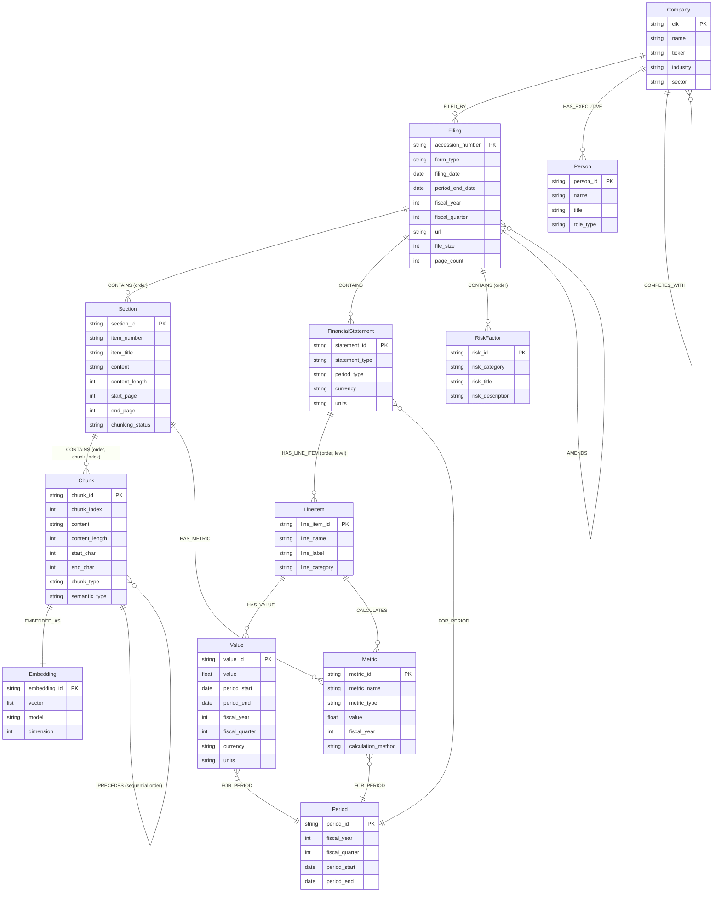
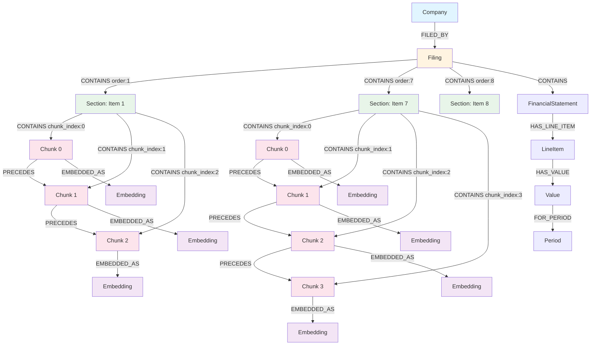

# Neo4j EDGAR Graph Schema - Mermaid Diagram

## Complete Schema Diagram



## Hierarchical Relationship Flow



## Key Relationships Summary

### 1. Document Hierarchy (Filing → Section → Chunk)
- **Filing CONTAINS Section:** One-to-many, with `order` property
- **Section CONTAINS Chunk:** One-to-many, with `order` and `chunk_index` properties
- **Chunk PRECEDES Chunk:** Sequential ordering within section

### 2. Chunk Ordering
- **Property-based:** `chunk_index` (0, 1, 2, ...) for fast sorting
- **Relationship-based:** `PRECEDES` for graph traversal
- **Both mechanisms ensure correct order**

### 3. Citation Support
- **Filing:** accession_number, form_type, filing_date, url, fiscal_year
- **Section:** section_id, item_number, item_title, start_page, end_page
- **Chunk:** chunk_id, chunk_index, start_char, end_char
- **Full path traceable:** Company → Filing → Section → Chunk

### 4. Vector Search
- **Chunk → Embedding:** One-to-one relationship
- **Each chunk has exactly one embedding**
- **Vector index on Embedding.vector for similarity search**

## Example: Retrieving Ordered Chunks with Citations

```cypher
// Get chunks for a section in order with full citation path
MATCH (c:Company {cik: "0000320193"})<-[:FILED_BY]-(f:Filing {accession_number: "0000320193-24-000077"})
MATCH (f)-[:CONTAINS]->(s:Section {item_number: "Item 7"})
MATCH (s)-[:CONTAINS]->(ch:Chunk)
MATCH (ch)-[:EMBEDDED_AS]->(e:Embedding)
RETURN 
  c.name AS company_name,
  c.ticker AS ticker,
  f.form_type AS form_type,
  f.fiscal_year AS fiscal_year,
  f.url AS filing_url,
  s.item_number AS section_item,
  s.item_title AS section_title,
  s.start_page AS section_start_page,
  s.end_page AS section_end_page,
  ch.chunk_index AS chunk_order,
  ch.chunk_id AS chunk_id,
  ch.content AS chunk_content,
  ch.start_char AS chunk_start_char,
  ch.end_char AS chunk_end_char,
  e.embedding_id AS embedding_id
ORDER BY ch.chunk_index ASC;
```

This query returns chunks in order with all information needed for citations.

