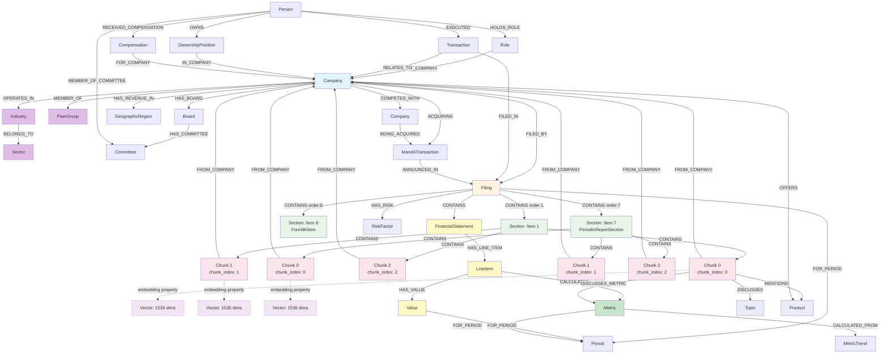

# Neo4j EDGAR Graph Schema - Mermaid Diagram v2.0

## Complete Schema Diagram

> **Source:** [diagrams/complete-schema-diagram.mmd](diagrams/complete-schema-diagram.mmd)

```mermaid
erDiagram
    %% Core Document Hierarchy
    Company ||--o{ Filing : "FILED_BY"
    Filing ||--o{ Section : "CONTAINS (order)"
    Filing ||--o{ FinancialStatement : "CONTAINS"
    Filing ||--o{ RiskFactor : "HAS_RISK (order)"
    Filing }o--|| Period : "FOR_PERIOD"
    
    %% Section Subtypes (Label Inheritance)
    Section ||--o{ Chunk : "CONTAINS"
    Section }|--|| Form8KItem : "is_a"
    Section }|--|| ProxySection : "is_a"
    Section }|--|| PeriodicReportSection : "is_a"
    
    %% Chunk with Direct Embedding Storage
    Chunk }|--|| TableChunk : "is_a"
    Chunk }o--|| Company : "FROM_COMPANY"
    Chunk ||--o{ Topic : "DISCUSSES (relevance)"
    Chunk ||--o{ Metric : "DISCUSSES_METRIC (sentiment)"
    Chunk ||--o{ Product : "MENTIONS"
    
    %% Financial Statements
    FinancialStatement ||--o{ LineItem : "HAS_LINE_ITEM (order, level)"
    LineItem ||--o{ Value : "HAS_VALUE"
    LineItem ||--o{ Metric : "CALCULATES"
    Value }o--|| Period : "FOR_PERIOD"
    Metric }o--|| Period : "FOR_PERIOD"
    Metric ||--o{ MetricTrend : "CALCULATED_FROM"
    
    %% Industry & Sector Hierarchy
    Company ||--o{ Industry : "OPERATES_IN (primary, revenue_pct)"
    Industry }o--|| Sector : "BELONGS_TO"
    Company ||--o{ PeerGroup : "MEMBER_OF"
    Company ||--o{ Company : "COMPETES_WITH (similarity_score, basis)"
    
    %% Geographic
    Company ||--o{ GeographicRegion : "HAS_REVENUE_IN (revenue_amount, revenue_pct)"
    Company ||--o{ Product : "OFFERS (is_primary)"
    
    %% Governance & Ownership
    Person ||--o{ Role : "HOLDS_ROLE"
    Role }o--|| Company : "AT_COMPANY"
    Person ||--o{ Transaction : "EXECUTED"
    Transaction }o--|| Company : "RELATES_TO"
    Transaction }o--|| Filing : "FILED_IN"
    Person ||--o{ OwnershipPosition : "OWNS"
    OwnershipPosition }o--|| Company : "IN_COMPANY"
    Person ||--o{ Compensation : "RECEIVED_COMPENSATION"
    Compensation }o--|| Company : "FOR_COMPANY"
    
    %% Board & Committees
    Company ||--o{ Board : "HAS_BOARD"
    Board ||--o{ Committee : "HAS_COMMITTEE"
    Person ||--o{ Committee : "MEMBER_OF_COMMITTEE (chair)"
    
    %% M&A Transactions
    Company ||--o{ MandATransaction : "ACQUIRING (role: acquirer)"
    Company ||--o{ MandATransaction : "BEING_ACQUIRED (role: target)"
    MandATransaction ||--o{ Filing : "ANNOUNCED_IN"
    MandATransaction ||--o{ Filing : "DETAILED_IN"
    
    %% Document Relationships
    Filing ||--o{ Filing : "REFERENCES (reference_type)"
    Filing ||--o{ Filing : "AMENDS (amendment_date)"

    Company {
        string cik PK
        string name
        string ticker
        string sic
        string sic_description
        string industry
        string sector
        string exchange
        float market_cap
        string market_cap_tier
        string incorporation_state
        string incorporation_country
        string fiscal_year_end
        string irs_number
        string business_address
        string phone
        string website
        datetime created_at
        datetime updated_at
    }
    
    Filing {
        string accession_number PK
        string form_type
        date filing_date
        date period_end_date
        int fiscal_year
        int fiscal_quarter
        string fiscal_period
        string url
        int file_size
        int page_count
        boolean is_amendment
        string amendment_type
        string original_accession
        string company_cik
        string company_name
        string company_ticker
        datetime created_at
        datetime updated_at
        string ingestion_status
        map processing_metadata
    }
    
    Section {
        string section_id PK
        string item_number
        string item_title
        string subsection
        string content
        int content_length
        int start_page
        int end_page
        int word_count
        string company_cik
        int fiscal_year
        string form_type
        datetime created_at
        datetime updated_at
    }
    
    Form8KItem {
        string item_code
        string event_type
        date event_date
        boolean is_material
        boolean financial_data_included
        list exhibits_included
    }
    
    ProxySection {
        string section_type
        boolean vote_required
        int proposal_number
        date meeting_date
        date record_date
        boolean has_compensation_table
    }
    
    PeriodicReportSection {
        boolean is_audited
        string period_type
        boolean is_restated
        date restatement_date
    }
    
    Chunk {
        string chunk_id PK
        int chunk_index
        string content
        int content_length
        int word_count
        int token_count
        string chunk_type
        string semantic_type
        int start_char
        int end_char
        list embedding
        string embedding_model
        int embedding_dimension
        datetime embedding_created_at
        string company_cik
        int fiscal_year
        int fiscal_quarter
        string form_type
        string section_item
        string context_before
        string context_after
        boolean contains_financial_data
        boolean contains_metrics
        list mentions_competitors
        list mentions_products
        list date_range_mentioned
        datetime created_at
        map metadata
    }
    
    TableChunk {
        map table_structure
        int table_rows
        int table_columns
        boolean has_header
        string table_type
        string table_caption
        list column_headers
        list row_headers
    }
    
    FinancialStatement {
        string statement_id PK
        string statement_type
        string period_type
        string currency
        string units
        string reporting_basis
        string company_cik
        int fiscal_year
        datetime created_at
    }
    
    LineItem {
        string line_item_id PK
        string line_name
        string line_label
        string line_category
        string line_subcategory
        boolean is_calculated
        string calculation_formula
        string xbrl_tag
        string xbrl_namespace
        int display_order
        int indentation_level
        string parent_line_item
        datetime created_at
    }
    
    Value {
        string value_id PK
        float value
        date period_start
        date period_end
        int fiscal_year
        int fiscal_quarter
        string currency
        string units
        boolean is_restated
        date restatement_date
        int decimals
        string xbrl_context
        datetime created_at
    }
    
    Period {
        string period_id PK
        int fiscal_year
        int fiscal_quarter
        date period_start
        date period_end
        string period_type
        int days_in_period
        datetime created_at
    }
    
    Metric {
        string metric_id PK
        string metric_name
        string metric_display_name
        string metric_type
        string metric_category
        float value
        date period_start
        date period_end
        int fiscal_year
        int fiscal_quarter
        string calculation_method
        string calculation_formula_cypher
        list source_line_items
        string company_cik
        boolean is_derived
        float confidence_score
        datetime created_at
        datetime recalculated_at
    }
    
    MetricTrend {
        string trend_id PK
        string metric_name
        string company_cik
        int start_year
        int end_year
        int period_count
        string trend_type
        float trend_value
        float r_squared
        string trend_direction
        float volatility
        datetime created_at
    }
    
    RiskFactor {
        string risk_id PK
        string risk_category
        string risk_title
        string risk_description
        string risk_severity
        boolean is_new_risk
        string company_cik
        int fiscal_year
        datetime created_at
    }
    
    Person {
        string person_id PK
        string name
        int age
        string background_summary
        string education
        datetime created_at
        datetime updated_at
    }
    
    Role {
        string role_id PK
        string title
        string role_type
        date start_date
        date end_date
        boolean is_current
        boolean is_independent
        list committee_memberships
        float board_tenure_years
        datetime created_at
    }
    
    Compensation {
        string compensation_id PK
        int fiscal_year
        float total_compensation
        float salary
        float bonus
        float stock_awards
        float option_awards
        float non_equity_incentive
        float pension_value
        float other_compensation
        string currency
        float ceo_pay_ratio
        datetime created_at
    }
    
    Transaction {
        string transaction_id PK
        date transaction_date
        date filing_date
        string form_type
        string transaction_type
        string security_type
        int shares
        float price_per_share
        float transaction_value
        int shares_owned_before
        int shares_owned_after
        string ownership_type
        string ownership_nature
        boolean is_10b5_1
        string transaction_code
        datetime created_at
    }
    
    OwnershipPosition {
        string position_id PK
        date as_of_date
        int shares_owned
        float ownership_percentage
        string ownership_type
        float market_value
        string source_form
        string source_filing
        datetime created_at
    }
    
    Industry {
        string industry_id PK
        string industry_name
        string sic_code
        string naics_code
        string description
        datetime created_at
    }
    
    Sector {
        string sector_id PK
        string sector_name
        string description
        datetime created_at
    }
    
    Topic {
        string topic_id PK
        string topic_name
        string topic_category
        list keywords
        string description
        datetime created_at
    }
    
    Product {
        string product_id PK
        string product_name
        string product_category
        string description
        datetime created_at
    }
    
    GeographicRegion {
        string region_id PK
        string region_name
        string region_type
        string iso_code
        string parent_region
        datetime created_at
    }
    
    PeerGroup {
        string group_id PK
        string group_name
        string group_type
        map criteria
        datetime created_at
        datetime updated_at
    }
    
    Board {
        string board_id PK
        int fiscal_year
        int total_directors
        int independent_directors
        int board_size
        int diversity_count
        float average_tenure
        int meeting_count
        datetime created_at
    }
    
    Committee {
        string committee_id PK
        string committee_name
        string committee_type
        boolean is_independent
        int member_count
        int meeting_count
        int fiscal_year
        datetime created_at
    }
    
    MandATransaction {
        string transaction_id PK
        string transaction_type
        date announcement_date
        date expected_closing_date
        date actual_closing_date
        float transaction_value
        string deal_structure
        map payment_breakdown
        string status
        string strategic_rationale
        string termination_reason
        datetime created_at
    }
```



## Hierarchical Relationship Flow

> **Source:** [diagrams/hierarchical-relationship-flow.mmd](diagrams/hierarchical-relationship-flow.mmd)



## Key Design Changes from v1.0

### 1. Vector Storage (OPTIMIZED)
- ✅ **Embeddings stored directly on Chunk nodes** as `embedding` property
- ❌ **NO separate Embedding nodes** (removed in v2.0)
- **Benefit**: Single node access, 50% fewer query hops

### 2. Chunk Ordering (SIMPLIFIED)
- ✅ **Property-based ordering only**: `chunk_index` (0, 1, 2, ...)
- ❌ **NO PRECEDES relationships** (removed in v2.0)
- **Benefit**: Simpler queries, faster ordering with `ORDER BY chunk_index`

### 3. Form-Specific Section Types (NEW)
- ✅ **Form8KItem**: For 8-K filings with event-specific properties
- ✅ **ProxySection**: For DEF 14A filings with governance properties
- ✅ **PeriodicReportSection**: For 10-K/10-Q filings with audit properties
- **Benefit**: Type-specific queries, better semantic understanding

### 4. Denormalization for Performance (NEW)
- ✅ **Direct FROM_COMPANY relationship** from Chunk to Company
- ✅ **Denormalized properties** on Chunk: `company_cik`, `fiscal_year`, `form_type`, `section_item`
- **Benefit**: Filter chunks without traversing Filing/Section hierarchy

### 5. Enhanced Entity Model (NEW)
- ✅ **Industry & Sector**: Hierarchical classification
- ✅ **Topic**: Semantic topics discussed in chunks
- ✅ **Product**: Products mentioned in filings
- ✅ **GeographicRegion**: Geographic revenue breakdown
- ✅ **PeerGroup**: Systematic peer comparison support

### 6. Governance & Ownership (NEW)
- ✅ **Person, Role, Compensation**: Executive compensation tracking
- ✅ **Transaction, OwnershipPosition**: Insider trading support
- ✅ **Board, Committee**: Board composition and governance

### 7. M&A Transactions (NEW)
- ✅ **MandATransaction**: Acquisition, divestiture, merger tracking
- ✅ Links to acquiring and target companies
- ✅ Links to filings where announced

### 8. Enhanced Financial Model (IMPROVED)
- ✅ **MetricTrend**: Trend analysis over time periods
- ✅ **XBRL support**: `xbrl_tag`, `xbrl_namespace` on LineItem
- ✅ **TableChunk**: Structured table representation

## Query Pattern Examples

### Vector Search (Optimized - 2 hops instead of 6)
```cypher
// Direct vector search with company filtering
CALL db.index.vector.queryNodes('textChunkEmbeddings', 20, $queryEmbedding)
YIELD node AS chunk, score
WHERE chunk.company_cik = $cik 
  AND chunk.fiscal_year = $year
  AND score > 0.7
MATCH (chunk)-[:FROM_COMPANY]->(company:Company)
RETURN 
  company.name,
  chunk.form_type,
  chunk.fiscal_year,
  chunk.section_item,
  chunk.content,
  score
ORDER BY score DESC
LIMIT 10;
```

### Ordered Chunk Retrieval (Simplified - No PRECEDES)
```cypher
// Get chunks in order using property-based ordering
MATCH (c:Company {cik: $cik})<-[:FILED_BY]-(f:Filing {accession_number: $accession})
MATCH (f)-[:CONTAINS]->(s:Section {item_number: "Item 7"})
MATCH (s)-[:CONTAINS]->(ch:Chunk)
WHERE ch.company_cik = $cik  // Filter using denormalized property
RETURN 
  c.name AS company_name,
  f.form_type,
  f.fiscal_year,
  s.item_number,
  ch.chunk_index,
  ch.content,
  ch.embedding  // Direct access to embedding
ORDER BY ch.chunk_index ASC;  // Simple property ordering
```

### Peer Comparison (NEW)
```cypher
// Compare metrics across peer group
MATCH (target:Company {cik: $cik})-[:MEMBER_OF]->(pg:PeerGroup)<-[:MEMBER_OF]-(peer:Company)
MATCH (m1:Metric {company_cik: target.cik, metric_name: 'revenue', fiscal_year: $year})
MATCH (m2:Metric {company_cik: peer.cik, metric_name: 'revenue', fiscal_year: $year})
RETURN 
  target.name AS target,
  m1.value AS target_revenue,
  peer.name AS peer,
  m2.value AS peer_revenue,
  (m1.value / m2.value) AS ratio
ORDER BY m2.value DESC;
```

## Performance Optimizations

### 1. Reduced Query Hops
- **v1.0**: Company → Filing → Section → Chunk → Embedding (5 hops)
- **v2.0**: Chunk → Company (1 hop) + direct embedding property (0 hops)
- **Improvement**: 60% reduction in query complexity

### 2. Specialized Vector Indexes
- `textChunkEmbeddings`: General text content
- `riskChunkEmbeddings`: Risk factor discussions
- `financialChunkEmbeddings`: Financial analysis
- `strategyChunkEmbeddings`: Strategic/forward-looking content
- `maChunkEmbeddings`: M&A and transactions

### 3. Composite Indexes
- `filing_company_period`: (company_cik, fiscal_year, form_type)
- `chunk_company_period`: (company_cik, fiscal_year, chunk_type)
- `metric_company_period`: (company_cik, metric_name, fiscal_year)

## Citation Support

Full citation path preserved:
- **Company**: cik, name, ticker
- **Filing**: accession_number, form_type, filing_date, fiscal_year, url
- **Section**: section_id, item_number, item_title, start_page, end_page
- **Chunk**: chunk_id, chunk_index, start_char, end_char
- **Direct access**: Chunk → Company (via FROM_COMPANY relationship)

---

**Version:** 2.0  
**Date:** 2025-12-28  
**Status:** Production-Ready Design  
**Based on:** neo4j-edgar-schema-design-v2.md


